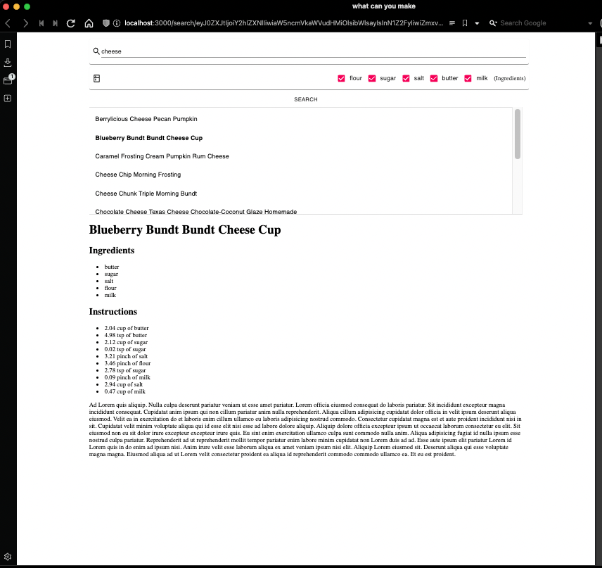

# Zeal RECIPIES

Time Spent: ~3.5 hours 

⚠️ `version-2` branch (completed outside the alotted time) contains all bonus work and other upgrades.

----
## Task Tracking:

- **Backend:**
    - [x]  there's a missing api, here's the spec product has given you to implement:
- **Frontend:**
    - [x]  fix the search function
    - [x]  add a recipe component to display the response
    - [x]  add routing so that you can land on a recipe page or reload and have the same search
- ************Bonus:************
    - [ ]  add deployments using heroku, digital ocean, etc.
    - [x]  containerize the application
    - [ ]  add ci/cd using travis, circleCI, etc...

## Explanations

- Fire up the project with `yarn start`
- How state is maintained on refresh:
    
    You’ll notice that when an ingrediant is selected or the search input is updated, the url is set with a `http://.../state/{encoded}` — this is an encoding of the current “search state”. On page load, the state is decoded and the api is poked to retrieve the associated data. 
    
- How to land directly on a recipe:
    
    Given you know the `id` of some recipe, you can navigate to `http://.../recipe/{id}` to load that recipe directly. For simplicity (& time constraints) you can’t search by name… I would have displayed the recipe `Id` is search results, but the task definition excludes `id` from the search response.
    
- Dockerize with `docker compose up` .. ********************************************
    
    **********************BEFORE DOING THAT********************** set `usingDocker=true` in the *webpack.config* file (ugly, sorry). This variable will set the dev server `host` to `0.0.0.0` instead of localhost (similar to aliasing host.docker.internal). ************************************************************************************************************Better yet, just use yarn start because I ran out of time debugging the webpack-dev-server so, while the UI looks great when running from the container, the backend refuses to connect.************************************************************************************************************ 
    
- Why some things suck a little:
    
    Because the whole point of this project was to work ******within****** an existing codebase, I chose to work with things as they’d been developed rather than what I am more familar with (e.g., using React’s Component Classes instead of Functional Components). Also, the PnP + Webpack was definitly a hurdle in terms of time spent researching vs time spent developing.
    
---
## Retro:

The frontend portion of this project took 95% of the time; a few things were ************just enough************ unfamiliar such that I had to spend most my time researching. 

- **Yarn:***pnp*** (plug-n-play)**
    - My experience: Yarn 1
    - An awesome upgrade from Yarn 1..
- **Redux**
    - omg i just spent an 45 minutes figuring out why the Redux connect wasn’t working…  I was importing the Component ({Child}) rather than the higher order Redux component.
    - My experience: (kinda equivalent) React Context
- **Mongoose**
    - My experience: DynamoDB
- **Webpack**
    - I’ve used it but never had to debug it.. wow theres a lot of configurations..
    - It doesn’t play super nice with Docker containers

**Failures:**

- I could not get the webpack-dev-server to keep the backend running in its Docker container. I will figure out why, but I ran out of time for this task. I suspect its a webpack config issue.

**Wins:**

- Yarn PnP is sweet and I got to spend some time researching it.
- The backend portion of this took me like 5 minutes (I do wish there was more to do there).

